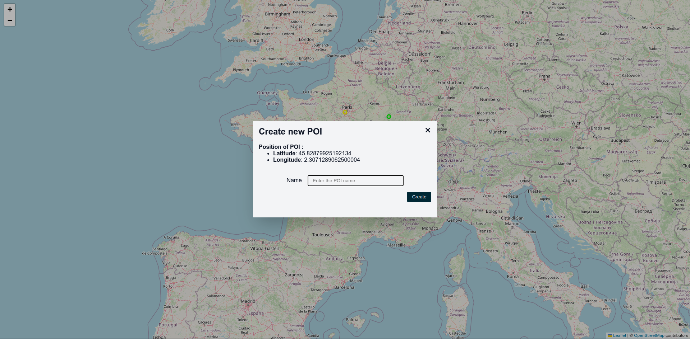

# Kuzzle Interactive map

This Repo is front-end app for accomplish challenge of [Kuzzle - Interactive POI Map](https://github.com/kuzzleio/kuzzle-challenges/blob/master/interactive-map.md).

## Result



## Project setup

```
yarn install
```

### Compiles and hot-reloads for development

```
yarn serve
```

### Compiles and minifies for production

```
yarn build
```

### Lints and fixes files

```
yarn lint
```

### Customize configuration

See [Configuration Reference](https://cli.vuejs.org/config/).
